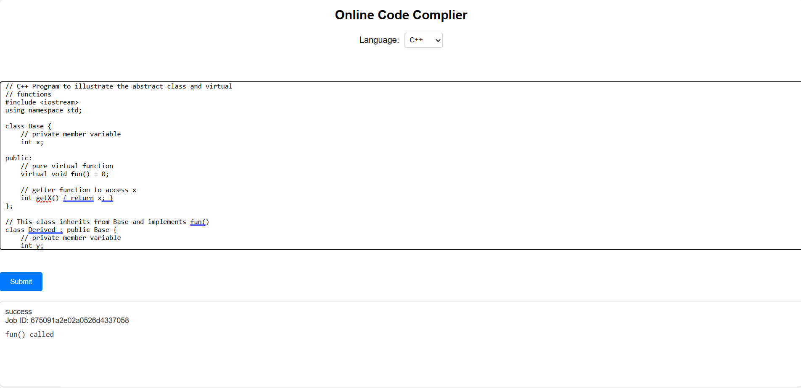

# Online Code Compiler 🚀

An online code compiler built with **React.js** (frontend), **Node.js** and **Express.js** (backend), and **MongoDB** (database). This app allows users to write, compile, and execute code directly from their browser.

## Features ✨

- 🖥️ **Code Execution**: Supports multiple programming languages like Python, Java, C++, and more.
- 🎨 **Syntax Highlighting**: Syntax highlighting for a better coding experience.
- 🔐 **User Authentication**: Register and login to save your previous code snippets.
- ⚡ **Real-time Output**: Displays compiler output or errors in real-time.
- 📜 **Code History**: Save and view previously executed code.

## Tech Stack 💻

- **Frontend**: React.js
- **Backend**: Node.js, Express.js
- **Database**: MongoDB
- **Code Execution**: Docker containers for code isolation
- **Authentication**: JWT (JSON Web Tokens)

## Installation 🛠️

To run this project locally, follow these steps:

### Prerequisites 📝

- Node.js (v14 or higher)
- npm (v6 or higher) or yarn
- MongoDB (use local or cloud service like MongoDB Atlas)
- Docker (for code execution in isolated environments)

### Step 1: Clone the Repository 📂

Clone the repo to your local machine:

```bash
git clone https://github.com/SharmaSanchay/online-code-compiler.git
```
### Step 2 : Set Up the Backend
1.Navigate to backend directory:
```bash 
cd backend
```
2.Install to the backend directory
```bash
npm install
```
3. Start the backend server
```bash
npm start
```
#Step 3:Set Up the Frontend
1.Navigate to the frontend directory:
```bash
cd client
```
2.Install the necessary dependencies:
```bash
npm install
```
3.Start the frontend development server:
```bash
npm start
```
<h1>Demo picture of the Online Code Complier</h1>

